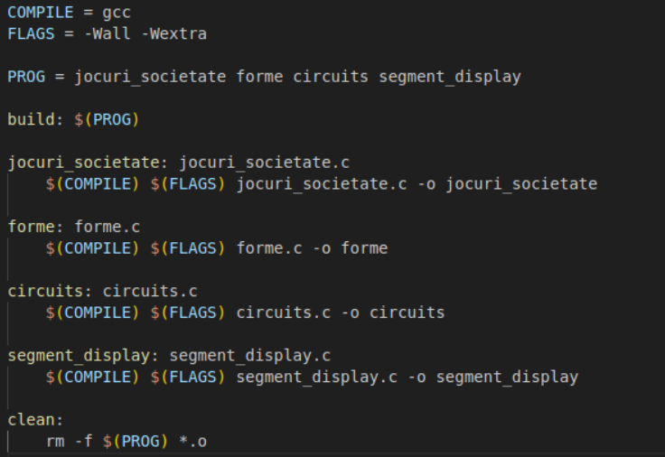

# Short review of C problems

The code is stored here: [Github](https://github.com/mihneagrigore/some_problems)

Please do not copy my code :)

---

## Table of Contents

1. [Problem 1: Board Games](#problem-1-board-games)
2. [Problem 2: Shapes](#problem-2-shapes)
3. [Problem 3: Circuits](#problem-3-circuits)
4. [Problem 4: Segment Display](#problem-4-segment-display)

---

## Problem 1: Board Games

The implemented algorithm uses a vector to store all initial values of shield objects. Simultaneously, heal objects are accumulated to add to the initial HP value. The shield vector is sorted in descending order using the **selection sort** method (in the `vector_sort()` function) to allow for easier access to the most suitable shield at each step.

Subsequently, the values of each enemy are read, and the `boss_fight()` function is called to search for the best shield for the given enemy value. After each shield usage, it is marked as used (value -1), and the vector is resorted to reflect the remaining shields.

Two scenarios are handled separately:
1. If there is a shield smaller than or equal to the enemy's power,
2. If the smallest shield greater than the enemy's power is chosen.

In the `main()` function, the three scenarios are handled depending on the result returned by the processing function. The **HP** variable is modified only if the chosen shield is smaller than the enemy's value. If the chosen shield is greater than the enemy's value, the **HP** remains unchanged, as required. If the **HP** value becomes 0 or negative after processing, the game ends in a loss.

---

## Problem 2: Shapes

The algorithm is modularized into void functions for each shape defined in the problem statement, which display the shape using '*' and ' '. In the `main()` function, the shape, size, and angle are read, and incompatible cases (such as negative size or angle) are handled. Additionally, the final row does not output the newline character.

Angles are processed using **`llabs`** (absolute value for long variables), as they can be negative. In the triangle function, negative angles are handled separately by applying a 360-degree period, and the shape is displayed based on four basic cases: **0°**, **90°**, **180°**, and **270°**.

---

## Problem 3: Circuits

The algorithm is modularized into two void functions that handle the two types of circuits. The `main` function calls these functions depending on the input sequence of characters.

Here you can see the `main` function code:

```C

int main(void)
{
	char c, buffer;

	scanf("%c", &c);
	scanf("%c", &buffer);
	if (c == 'I' && buffer == '\n') { //kirchhoff_1
		double intrari[NMAX] = {0}, iesiri[NMAX] = {0};

		kirchhoff_1(intrari, iesiri);
	}
	if (c == 'I' && buffer == 'I') {
		char buffer2;

		scanf("%c", &buffer2);
		if (buffer2 != '\n')
			printf("Legile existente sunt doar Legea 1 si Legea a 2-a\n");
		else
			kirchhoff_2();
	}
	return 0;
}
```

The `kirchhoff_1` function reads the nodes and currents, marking the voltage in the corresponding vectors (input or output). It also marks whether the node has been visited in the `pass` vector to verify if the circuit is open or closed. At the end, the function compares the input and output currents to determine if they are equal and displays the corresponding message (accounting for numerical errors due to operations on **`double`** data types).

The `kirchhoff_2` function reads and processes the resistor and generator sequence, handles error cases, and compares the summed values of batteries and consumers to check if they match.

---

## Problem 4: Segment Display

The algorithm is modularized into two void functions that process the digit shape (**`fill`**) and modifications (**`modify`**). The data structure defines the seven segments illustrated in the problem statement image. In the `main` function, a vector of the above structure type is defined to specify the required segments for each digit. Error cases are handled, and the corresponding function for the read character is called.

The **`fill`** function checks which segments are needed for the digit and allocates them in the matrix by marking the field with the value **1**. In the **`modify`** function, the corresponding row or column for the translation (using modulo operation) is calculated, and the new shape is formed in a temporary matrix. Finally, the matrix is updated with the data from the temporary matrix.

---

## Makefile

There is also a makefile

